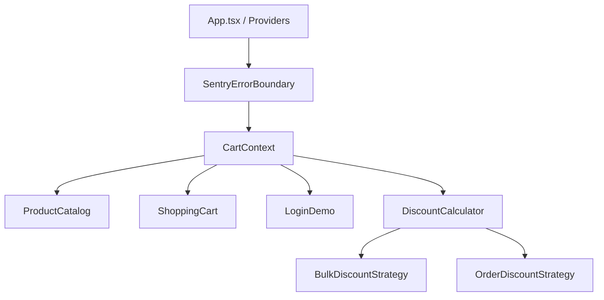

# 🛍️ Simple Product Shop (AI-Assisted E-Commerce)

[](https://react.dev/)
[](https://www.typescriptlang.org/)
[](https://vitejs.dev/)
[](https://vitest.dev/)
[](https://playwright.dev/)
[](https://sentry.io/)
[](https://opensource.org/licenses/MIT)

A modern, production-grade e-commerce single-page application built with **React 19**, **TypeScript**, and **Vite**. 

This repository serves as a showcase of **AI-assisted engineering**, **Test-Driven Development (TDD)**, the **Strategy Pattern** for scalable business logic, **Accessibility (a11y)** best practices, **Sentry** production monitoring, and automated **Husky** quality gates.

---

## 📑 Table of Contents
- [Quick Start & Installation](#-quick-start--installation)
- [Available Scripts](#-available-scripts)
- [Key Features](#-key-features)
- [Architecture & Design Patterns](#-architecture--design-patterns)
- [Testing & Quality Verification](#-testing--quality-verification)
- [AI Engineering & Prompt Traceability](#-ai-engineering--prompt-traceability)
- [Project Directory Structure](#-project-directory-structure)
- [Observability & Error Tracking](#-observability--error-tracking)
- [Troubleshooting & FAQ](#-troubleshooting--faq)
- [License](#-license)

---

## 🚀 Quick Start & Installation

Follow these simple steps to get the project running locally in under 2 minutes:

### 1. Prerequisites
Ensure you have the following installed on your machine:
- **Node.js**: `v20.x` or later ([Download Node.js](https://nodejs.org/))
  ```bash
  node -v
  ```
- **pnpm**: `v9.x` or later (Recommended package manager)
  ```bash
  # If you don't have pnpm installed:
  npm install -g pnpm
  pnpm -v
  ```

### 2. Clone the Repository
```bash
git clone https://github.com/AntonioHellin/simple-product-shop.git
cd simple-product-shop
```

### 3. Install Dependencies
```bash
pnpm install
```

### 4. Install Playwright Browsers (for E2E Tests)
```bash
pnpm exec playwright install chromium
```

### 5. Configure Environment Variables (Optional)
The project comes with a `.env.example` file. Sentry tracking is optional and disabled by default if no DSN is provided:
```bash
cp .env.example .env.local
```
*(If you wish to test real Sentry error reporting, add your Sentry DSN into `.env.local`)*.

### 6. Run the Development Server
```bash
pnpm dev
```
Open your browser and navigate to **`http://localhost:5173`** (or `http://localhost:5174` if port 5173 is occupied).

---

## 💻 Available Scripts

| Command | Description |
| :--- | :--- |
| `pnpm dev` | Starts local Vite development server with Hot Module Replacement (HMR). |
| `pnpm build` | Compiles TypeScript and builds production-ready bundle into `dist/`. |
| `pnpm preview` | Serves the production build locally for testing and verification. |
| `pnpm lint` | Runs ESLint across all codebase files. |
| `pnpm lint:fix` | Automatically fixes auto-fixable lint issues. |
| `pnpm typecheck` | Validates TypeScript types across the project (`tsc --noEmit`). |
| `pnpm test` | Launches Vitest in interactive watch mode. |
| `pnpm test:run` | Executes all 115 unit and component tests once (CI mode). |
| `pnpm test:coverage`| Runs test coverage analysis and outputs report table (80%+ threshold). |
| `pnpm test:e2e` | Executes Playwright end-to-end browser journeys headlessly. |
| `pnpm quality` | Fast pre-commit script: runs linting, typechecking, and unit tests. |
| **`pnpm verify`** | **Master validation script**: runs quality, E2E tests, and production build. |

---

## ✨ Key Features

1. **Product Catalog & Dynamic Feedback**:
   - Responsive product grid with loading shimmer animations (`Skeleton`, `ProductCardSkeleton`).
   - Tactile interactive button states: `idle`, `loading`, `success` (checkmark), and `error` (retry).
2. **Shopping Cart Drawer**:
   - Slide-over drawer with real-time subtotal, discount calculation, item quantity adjustments, and item removal.
   - State persistence across page reloads using browser `localStorage`.
3. **Flexible Discount Engine**:
   - Strategy-based calculation separating rules from presentation.
   - Bulk discounts (10% off for 3+ items) and Order discounts (15% off orders over 100€).
4. **Accessibility (a11y) First**:
   - Live regions (`aria-live="polite"`, `aria-atomic="true"`) announcing cart updates to screen readers.
   - Visually hidden accessible utility class (`.sr-only`).
   - High-contrast `:focus-visible` outlines for full keyboard navigation.
5. **Authentication Demo**:
   - Form validation with `onBlur` email checks, show/hide password toggle, lockout protection after 3 failed attempts, and pre-filled demo credentials.
6. **Observability**:
   - Sentry instrumentation capturing unhandled exceptions, React Error Boundary recovery screens, cart breadcrumbs, and user session context.

---

## 🏛️ Architecture & Design Patterns



### 1. Strategy Pattern (`src/shared/strategies`)
Instead of hardcoding discount rules into React components, discounts are modeled via polymorphic strategies implementing `IDiscountStrategy`:
- `BulkDiscountStrategy`: Applies a 10% discount on any line item with 3 or more units.
- `OrderDiscountStrategy`: Applies a 15% discount on total cart orders exceeding 100€.
- `DiscountCalculator`: Context class that dynamically evaluates all registered strategies and computes breakdown summaries without mutating state.

### 2. Page Object Model (POM) in E2E Testing (`e2e/pages`)
Playwright tests are decoupled from DOM selectors through dedicated page classes:
- `ProductCatalogPage.ts`: Encapsulates catalog interactions (e.g. `addProductToCart(name)`).
- `ShoppingCartPage.ts`: Encapsulates cart drawer interactions (e.g. `getCartTotal()`, `increaseQuantity(name)`).

### 3. Compound & Presentational Components
- Self-contained accessible primitives (`Skeleton`, `Toast`) adhering to WAI-ARIA authoring practices.
- State-driven styling via Vanilla CSS design tokens in `src/index.css`.

---

## 🧪 Testing & Quality Verification

This repository is protected by comprehensive test suites and automated quality gates:

### 1. Master Verification
Run the master script to validate the entire repository in one step:
```bash
pnpm verify
```
This single command runs:
1. `pnpm lint` (0 errors)
2. `pnpm typecheck` (0 type errors)
3. `pnpm test:run` (19 test files, 115 tests passing)
4. `pnpm test:e2e` (9 Playwright scenarios passing)
5. `pnpm build` (Production compilation with bundle analysis)

### 2. Code Coverage
Strict coverage thresholds are enforced in `vitest.config.ts`:
```bash
pnpm test:coverage
```

| Metric | Required Threshold | Current Coverage | Status |
| :--- | :---: | :---: | :---: |
| **Statements** | 80.00% | **89.61%** | ✅ PASS |
| **Branches** | 80.00% | **83.50%** | ✅ PASS |
| **Functions** | 80.00% | **87.09%** | ✅ PASS |
| **Lines** | 80.00% | **90.62%** | ✅ PASS |

### 3. Automated Git Hooks (Husky)
- **Pre-commit**: Automatically runs `pnpm lint` and `pnpm typecheck`. Commits with errors are blocked.
- **Pre-push**: Automatically runs `pnpm test -- --run` and `pnpm build`. Pushes with failing tests are blocked.

---

## 🤖 AI Engineering & Prompt Traceability

The construction of this application followed a structured AI-assisted pair-programming workflow adhering to **Test-Driven Development (Red -> Green -> Refactor)**.

All prompts, design decisions, and generated artifacts are systematically documented:

👉 **[Explore the Prompt Journey Dossier (`docs/PROMPT_JOURNEY.md`)](docs/PROMPT_JOURNEY.md)**

Key phases documented in the dossier:
1. **Phase 1**: Architecture & Scaffolding
2. **Phase 2**: Core UI Components & TDD Cycles (`Skeleton`, `Toast`, `ProductCard`, `DiscountCalculator`)
3. **Phase 3**: Accessibility (a11y) & Screen Reader live regions
4. **Phase 4**: Sentry Observability & Breadcrumbs
5. **Phase 5**: Quality Gates, Husky Hooks & Rollup Bundle Visualizer

In-code traceability is maintained via standardized JSDoc tags (`@prompt` and `@tdd`) in key test suites and component headers.

---

## 📂 Project Directory Structure

```text
simple-product-shop/
├── .husky/                   # Git pre-commit & pre-push automation hooks
├── docs/
│   └── PROMPT_JOURNEY.md     # Detailed prompt traceability & TDD methodology dossier
├── e2e/                      # Playwright End-to-End browser test suite
│   ├── pages/                # Page Object Model (POM) abstractions
│   │   ├── ProductCatalogPage.ts
│   │   └── ShoppingCartPage.ts
│   ├── shopping-journey.spec.ts # Full user e-commerce journeys
│   └── visual.spec.ts        # Visual regression snapshots
├── src/
│   ├── context/              # React Context providers (CartContext, useCart)
│   ├── features/
│   │   ├── auth/             # Login demo & password input components
│   │   ├── product-catalog/  # Product list, ProductCard & skeleton placeholders
│   │   └── shopping-cart/    # Shopping cart drawer, CartItem, & CartSummary
│   ├── infrastructure/       # Sentry initialization & SentryErrorBoundary
│   ├── shared/
│   │   ├── components/       # Shared UI primitives (Skeleton, Toast)
│   │   ├── hooks/            # Custom hooks (useCurrency)
│   │   ├── strategies/       # Discount calculation strategies (Strategy Pattern)
│   │   ├── types/            # TypeScript data contracts & models
│   │   └── utils/            # Calculation & formatting helper functions
│   ├── App.tsx               # Root component with providers & layout
│   ├── index.css             # Design tokens, focus styles, animations, .sr-only
│   └── main.tsx              # Application bootstrap & Sentry initialization
├── vitest.config.ts          # Vitest configuration with 80% coverage thresholds
└── vite.config.ts            # Vite configuration with Rollup bundle visualizer
```

---

## 📡 Observability & Error Tracking

The application integrates `@sentry/react` for telemetry:
- **Crash Recovery**: `SentryErrorBoundary` intercepts runtime component exceptions and provides a user-friendly recovery interface.
- **Cart Breadcrumbs**: Every mutation (`ADD_ITEM`, `REMOVE_ITEM`, `UPDATE_QUANTITY`) logs an event in Sentry's timeline.
- **User Identification**: Logging in attaches user context (`Sentry.setUser`), while logout clears it.
- **Developer Test Button**: A trigger button in the demo UI (`Trigger Sentry Error`) enables instant verification of Sentry event delivery.

---

## ❓ Troubleshooting & FAQ

### Port `5173` is already in use
Vite will automatically fall back to `http://localhost:5174`. The terminal will indicate the active port.

### Playwright fails with "Executable doesn't exist"
Run the browser installation command:
```bash
pnpm exec playwright install chromium
```

### Sentry warning in browser console
```text
Sentry DSN not configured. Add your real DSN in .env.local to send events.
```
This is intentional for local development. If you do not have a Sentry account, the application will function normally without errors. To report real events, add `VITE_SENTRY_DSN=your_actual_dsn` to `.env.local`.

---

## 📄 License
This project is open-source and licensed under the [MIT License](LICENSE). Built as part of the Big School AI Master program.
